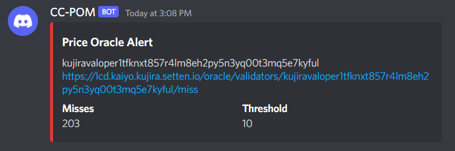

# Kujira Community Funding proposal for Crypto Chemistry Price Oracle Monitor

## Introduction
With the introduction of Price Oracles in v0.5.0 and Proposal 27, Kujira validators now need to monitor their price oracles to prevent slashing. A common tool that many validators run is Tenderduty by block pane, which is a major source of inspiration for the CC-POM. The CC team takes a Linux like mindset of "Each program does one thing and does it well".

We believe that a tool dedicated to monitoring price oracle uptime is necessary for validators in the Kujira ecosystem. As such, we are proposing a new tool Crypto Chemistry's Price Oracle Monitor (CC-POM), dedicated to the monitoring and alerting of price oracles.

## What is CC-POM?
CC-POM is a monitoring and alerting tool that provides validators with status updates and timely alerts of critical conditions of their price oracles. It will integrate with Discord and Pagerduty to start. 

## Roadmap
In the first release CC-POM will have both Discord and Pagerduty alerting capabilities. 

After an initial release and feedback from validators is received, additional features will be considered for implementation, including:
- Modifiable alert levels and frequency
    - eg. 100 misses triggers a Discord alert while 500 triggers a PagerDuty incident
- Ability to specify fallback API endpoints
- Customizable alert formatting
- Slack, OpsGenie, and Telegram integrations

## Core Values
- Always open-source: We believe that any community funded development should be entirely transparent and open-source, with permissive licenses for anyone to expand on.
- Continued Support: We will maintain this tool as long as we are active in the Kujira ecosystem.
- Reliability: As an alerting and monitoring tool, reliability is critical to the success and useful of the tool.

## Our Proposal
$5,000 for the initial development, testing, and support of CC-POM.

The breakdown of the estimated hours spent as part of this proposal is below.
- Initial Development (minimum viable product): 20 hours
- Additional Feature Development: 60 hours
- Testing and Documentation: 20 hours

- Average Hourly Rate: $50 USD

This is intended to be a one-time funding proposal with no plans for recurring funding proposals.

## Fund Allocation
If the proposal passes, the funds will be handled as follows:

- 100% of the $KUJI will be sold to alxUSDC via FIN to fund the development of the project

## About Crypto Chemistry
We are Crypto Chemistry and we are a small team of node operators and content creators that have been involved in the crypto space, including the Cosmos ecosystem, since 2017. We provide professional validator services and aim to provide our clients high up-time services while ensuring we provide top-tier security & stability for the networks we validate.

In addition to our validator services, our team strives to give back to the communities we serve through our focus on the development of tooling and creation of informational and educational content. 

Our goal is to help web3 users and developers alike seamlessly integrate into the Cosmos community by providing them with the necessary resources and tools to contribute to the ecosystem in addition to providing secure reliable nodes to delegate their staked tokens.

### Technical Credentials
The development of this tool will be done primarily by Relyte, Crypto Chemistry's node operator. Relyte has experience working as both a DevOps Engineer and Security Engineer within the SaaS and Defense industries. He has shown a willingness and capability to provide tools to the community. Recently he has released another monitoring tool that will help Kujira validators receive alerts regarding their price oracle wallet balances in the case that they are critically low: https://github.com/Crypto-Chemistry/walletmon

Crypto Chemistry Github: https://github.com/Crypto-Chemistry/

Relyte Github: https://github.com/Relyte

## FAQ
### What's wrong with Grafana/Prometheus for this?

Nothing is inherently wrong with using Grafana and Prometheus to configure alerting for price-oracle stats. However, we believe that multiple systems should be used while configuring a system's alerting. This doesn't compete with using Grafana for this purpose, but rather acts as a different implementation of alerting in case the Grafana alerts fail. 

### How did we arrive at $5,000 for the amount requested?

We planned out the requirements and features that we'd like to create for the application and assigned an estimate for how long it would take to implement. The breakdown of hours in the [Our Proposal](#our-proposal) section details the high-level estimates for this proposal. For the rate of $50 USD/hour, we believe that this is a reasonable hourly rate for the work proposed.

### My question's not here. Where can I get some answers before voting on the proposal?

You can reach us on Twitter or Discord most reliably. We'll be active in the Kujira Discord and monitoring the proposal_discussion channel. Feel free to tag us so we see the question quicker as well! We want the community to better discuss all governance proposals when it comes to community funds, so please critique this proposal and discuss any concerns with us. At the end of the day, discussion will drive governance proposals to hopefully be better as the Kujira ecosystem continues to grow.

Twitter: [@CryptoChem0000](https://twitter.com/CryptoChem0000) / [@RelyteCrypto](https://twitter.com/RelyteCrypto) / [@Crypto_Chem](https://twitter.com/Crypto_Chem)

Discord: CryptoChem0000#3142 / Relyte | Crypto Chemistry#5592 / Mister Swiss#5078